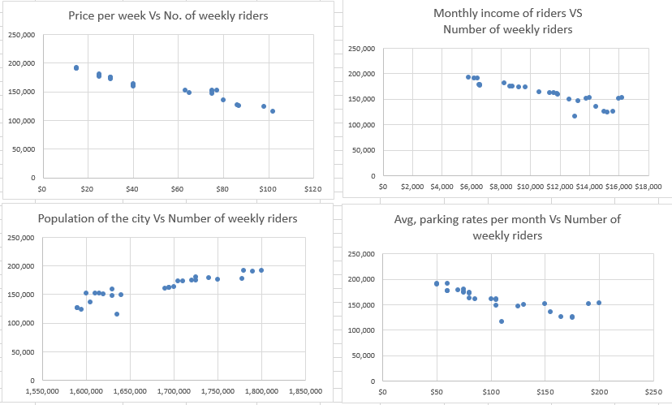
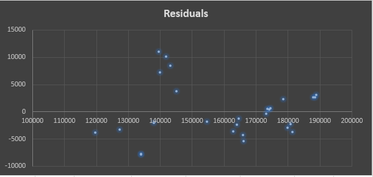

# Regression analysis in excel
This analysis has a small dataset which explores the dataset from application point of view and I hope it would be a precursor to complex analysis using the same or different technique. 

*Note*:
* Microsoft Excel's regression limits to linear regression analysis however one can try to fit with one independent variable or multiple independent variables.
* R2 is *R-squared value* which is defined as the measure of proprortion of variance of dependent variable explained by the independent variable. The higher the proportion, the better is the relationship between dependent and independent variable/s.

## Dataset 1 - Transit Demand:
The first dataset is a transit demand data set and the dependent variable under consideration is **Number of weekly riders** and there are four independent variables whose predictability we want to know.

### What do the trends say?

All the scatter plots helps use decide to go for a linear regression model

**Assumptions to apply linear regression model?**
1. There must be a linear relation between independent and dependent variables. 
2. There should not be any outliers present. 
3. No heteroscedasticity 
4. Sample observations should be independent.
5. Error terms should be normally distributed with mean 0 and constant variance. 
6. Absence of multicollinearity and auto-correlation.

Though it is not an exact linear relation, the whole purpose of modelling is to understand the uncertainty complemented with statistical analysis. Let's apply the regression technique and discover if the assumptions get validated without which our model doesn't stand a suitable fit for the given data and future predictions.

### Results of the model**:

### Evaluation of fit/ model:**

**R2 Value** = 0.95

While R2 is one parameter to look out for, the most standard way is to check the residual plotst to evaluate the model. The more random the errors are, the better your model. It means you shouldn't be able to form a pattern in any part of the plot as far residuals are concerned.

#### Validating assumptions:
**1. There must be a linear relation between independent and dependent variables.**
The first assumption can be validated from the scatter plots and the results of the regression which showcases different coefficients and the fitted values are calculated using the linear equation. Y = β0 + β1X1 + β2X2 + .... + (error)

**2. There should not be any outliers present.**
The residuals mustn't be more than 3 standard deviations away from the residual mean. Let's check that with a calculation of standardized residuals.

**3. No heteroscedasticity.**
This means the residuals must have a constant variance across all the observations. The residual vs fitted values plot tells about it.

*Residual plot for this model*:

In our residual plot, the variance fans in which is a sign of heteroscedasticity. A different interpretation is that it can be seen that for fitted values < 140000 of the **Number of weekly riders** variable, residuals are -ve while they are +ve in between [1400000, 150000]. This made me easy to find out a pattern which is not the desired outcome when checking for goodness of fit via residual plots.

**4. Sample observations should be independent.**
**5. Error terms should be normally distributed with mean 0 and constant variance.** 

**6. Absence of multicollinearity and auto-correlation.**

It's time to evaluate assumptions to check the goodness of fit and find problems with the model in spite of a good R2 value and improve the model.

### References used:
http://blog.excelmasterseries.com/2014/05/linear-regressions-required-assumptions.html

